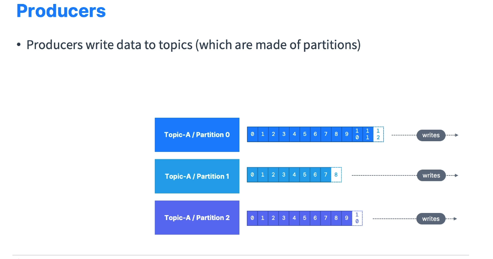
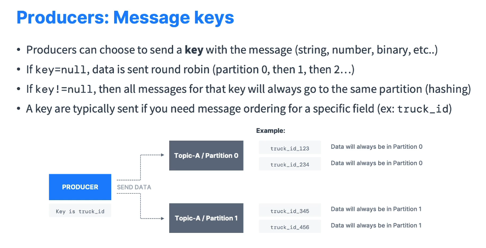
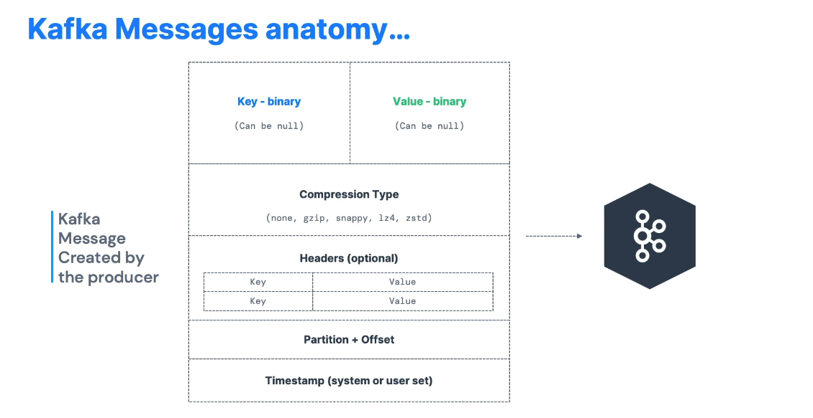
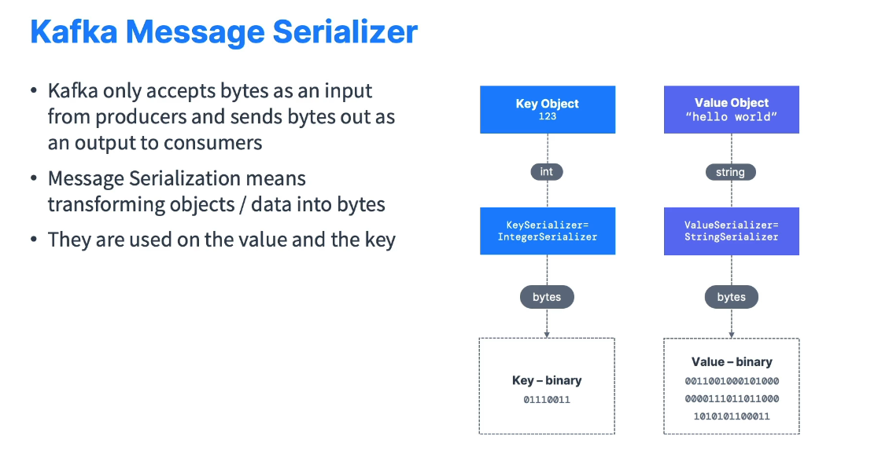
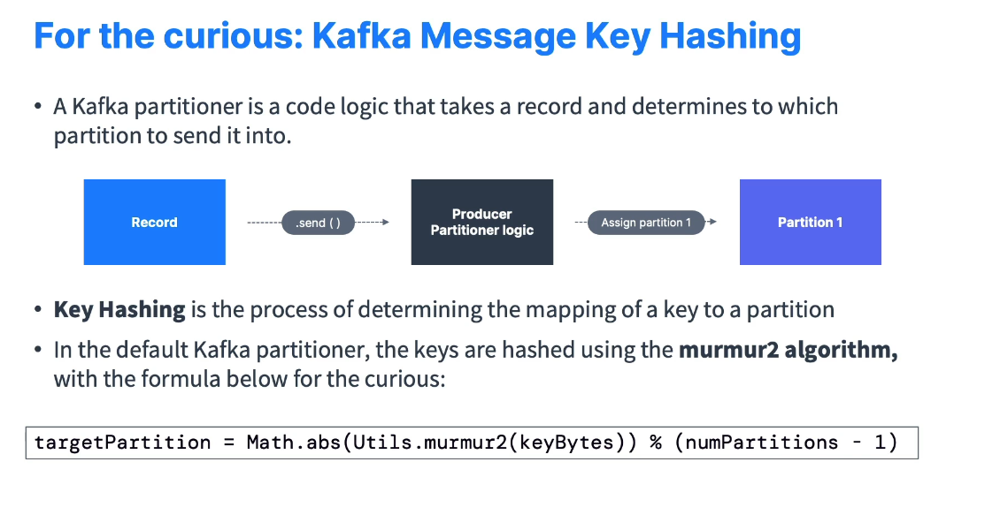

# Kafka Producers

This document provides an overview of **Kafka Producers**—the components responsible for writing data (messages) to **Kafka Topics**.

---

## Table of Contents

- [Kafka Producers](#kafka-producers)
  - [Table of Contents](#table-of-contents)
  - [Introduction](#introduction)
  - [Producer Responsibilities](#producer-responsibilities)
  - [Keys and Partitioning](#keys-and-partitioning)
    - [Example](#example)
  - [Kafka Message Structure](#kafka-message-structure)
  - [Kafka Message Serialization](#kafka-message-serialization)
    - [Example](#example-1)
  - [Advanced: How Keys are Hashed](#advanced-how-keys-are-hashed)
  - [Conclusion](#conclusion)

---

## Introduction

- **Producers** are applications (or services) that **write data** to topics in a **Kafka cluster**.
- They determine **which topic partition** each message is sent to.
- Kafka is **fault-tolerant**, so if a partition or broker goes down, the producer handles retries automatically behind the scenes.



---

## Producer Responsibilities

1. **Send Messages to a Topic**
   - Producers specify:
     - **Topic name** (e.g., `topicA`)
     - **Partition** (decided by the producer, possibly via a key-based strategy)
2. **Handle Partition Logic**
   - Producers use **partitioning** to distribute data across the topic’s partitions.
3. **Recover from Failures**
   - In case of broker or network issues, producers retry sending messages.

---

## Keys and Partitioning

- A **key** in a Kafka message is **optional**.
- **No Key (key = null)**
  - Messages are sent in a **round-robin** fashion across all partitions, enabling **load balancing**.
- **With Key**
  - All messages with the **same key** go to the **same partition**.
  - This helps maintain **ordering** for messages that share a key (e.g., `truckID` in a fleet-tracking scenario).



### Example

- Topic with **2 partitions** (partition 0 and partition 1).
- **Key = null**: Producer sends messages alternately to partition 0, then partition 1, etc.
- **Key ≠ null**: Producer calculates a **hash** of the key to consistently determine the same partition for identical keys.

---

## Kafka Message Structure



Each Kafka message has:

1. **Key** (optional)
   - Can be **binary**, **string**, **integer**, etc.
2. **Value**
   - The **actual content** of your message (e.g., JSON, text, binary).
3. **Compression** (optional)
   - Supported algorithms: `gzip`, `snappy`, `lz4`, `zstd`.
4. **Headers** (optional)
   - A list of **key-value** pairs for additional metadata.
5. **Partition**
   - The **partition** in the topic where this message is stored.
6. **Offset**
   - The **sequential ID** assigned to the message within the partition.
7. **Timestamp**
   - Either set by the system (default) or by the user.

---

## Kafka Message Serialization

- Kafka **only accepts bytes** as an input from producers and sends byters out as an output to consumers.
- **Message Serialization** transform objects (e.g., integers, strings) into **byte arrays**.
- These serializers are used on key and value.
- Common serializers:
  - **String Serializer**
  - **Integer Serializer**
  - **Avro, Protobuf** (for structured data)
  - **JSON** (via string or custom serializer)

### Example



- **Key** = 123 (integer) → **Integer Serializer** → byte array
- **Value** = "Hello World" (string) → **String Serializer** → byte array

Once serialized, the producer sends the byte arrays to Kafka.

---

## Advanced: How Keys are Hashed



- **Producer Partitioner** is responsible for mapping a key to a specific partition.
- The **default partitioner** uses the **murmur2** hashing algorithm on the key’s bytes.
- Rough formula:
  ```java
     targetPartition = Math.abs(Utils.murmur2(keyBytes)) % (numPartitions - 1);
  ```

---

## Conclusion

Kafka Producers **create messages** and **decide** which partition those messages go to.  
Key highlights:

- **Load Balancing** without a key.
- **Ordering** for messages with the same key.
- **Serialization** ensures objects are converted to bytes.
- **Hashing** logic (partitioner) underpins consistent partition assignment.

With this understanding, you can configure producers effectively to leverage Kafka’s scalability and reliability.
