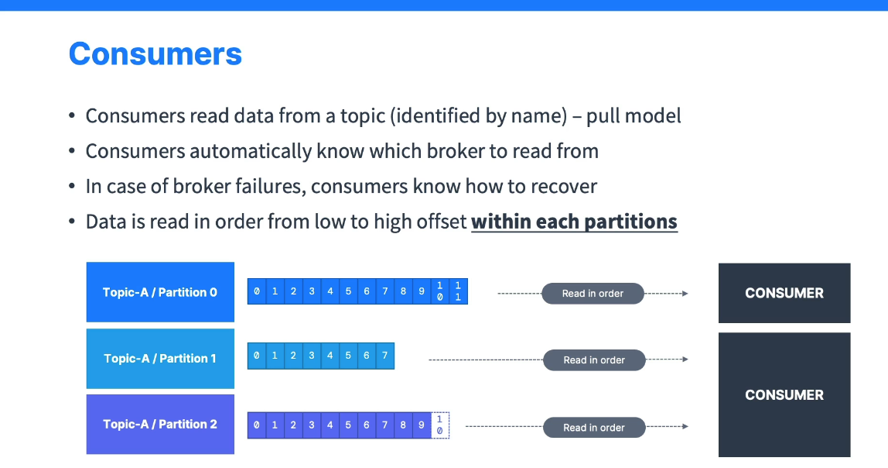
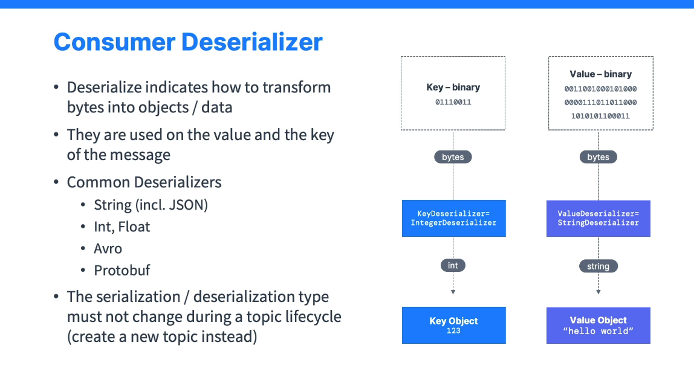

# Kafka Consumers

This document provides an overview of **Kafka Consumers**—the components responsible for reading data (messages) from **Kafka Topics**.

---

## Table of Contents

- [Kafka Consumers](#kafka-consumers)
  - [Table of Contents](#table-of-contents)
  - [Introduction](#introduction)
  - [Consumer Model](#consumer-model)
  - [Reading Data in Order](#reading-data-in-order)
  - [Deserialization](#deserialization)
    - [Example](#example)
      - [Common Deserializers](#common-deserializers)
  - [Data Format Compatibility](#data-format-compatibility)
  - [Conclusion](#conclusion)

---

## Introduction

- **Consumers** are applications that **read** data from **Kafka topics**.
- They work in a **pull** model, requesting data from **Kafka brokers** rather than receiving it via push.

---

## Consumer Model

1. **Pull Model**
   - Consumers **request** data from the brokers at their own pace.
2. **Partition Assignment**
   - A consumer can read from one **or** multiple **partitions** of a topic.
   - Consumers **know which broker** hosts the partition(s) they read from.
3. **Failover Handling**
   - If a **broker** (server) fails, consumers detect it and **recover** automatically.

---

## Reading Data in Order

- Data within each partition is **strictly ordered**.
- Consumers read messages in **ascending offset** order: `0, 1, 2, ...`.
- **No global ordering** exists across partitions. Order is guaranteed **only within** a single partition.

---

## Deserialization

- Data in Kafka is stored as **bytes** for both **key** and **value**.
- A **consumer** must use the corresponding **Deserializer** for each part:
  - **Key Deserializer**: Converts key bytes → target object (e.g., Integer).
  - **Value Deserializer**: Converts value bytes → target object (e.g., String).

### Example

- If the consumer expects an **Integer** key:
  - Uses an **Integer Deserializer** to convert bytes into an integer (e.g., `123`).
- If the consumer expects a **String** value:
  - Uses a **String Deserializer** to convert bytes into a string (e.g., `"Hello World"`).

#### Common Deserializers

- **String** (often used for JSON as well)
- **Integer**
- **Float**
- **Avro**
- **Protobuf**
- And more...

---

## Data Format Compatibility

- **Producers** and **consumers** must agree on the **data format** (e.g., key = integer, value = string).
- Changing data format in an **existing** topic can break consumers if they expect a different format.
- **Recommendation**: If you need to change data types or serialization methods, create a **new topic**.  
  Then reconfigure consumers to read from that new topic with the updated format.

---

## Conclusion

Kafka Consumers are central to **retrieving** data from Kafka topics. By following the **pull model** and applying the proper **deserializers**, they ensure that messages are read in **partition order** and converted to usable data types. Always maintain **data format consistency** within a topic to avoid breaking consumer applications.
