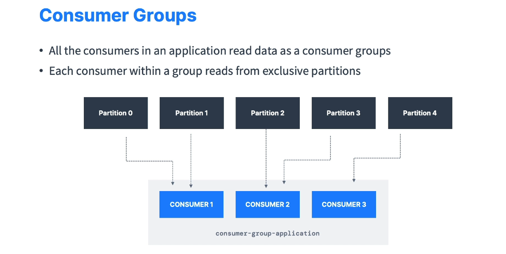
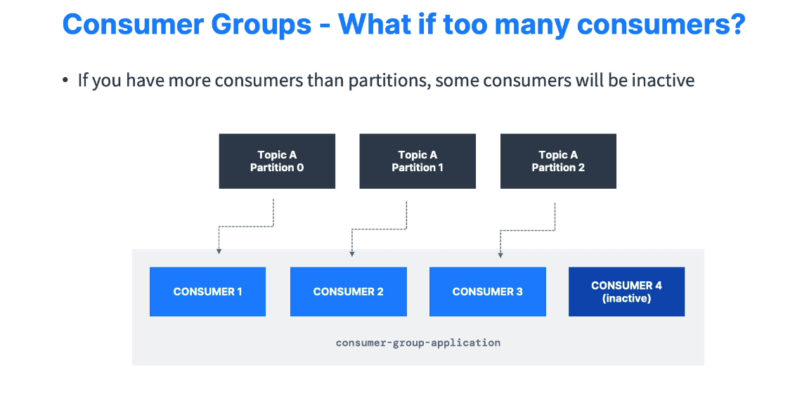
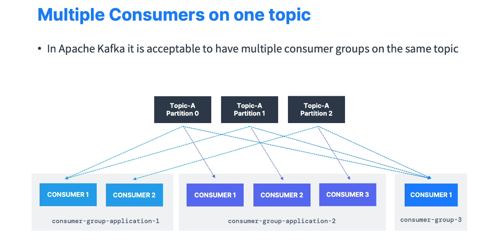

# Kafka Consumer Groups

This document provides an overview of **Kafka Consumer Groups**—how they work, how they scale, and how they handle offsets to ensure reliable data consumption.

---

## Table of Contents

- [Kafka Consumer Groups](#kafka-consumer-groups)
  - [Table of Contents](#table-of-contents)
  - [Introduction](#introduction)
- [Why does it work this way? ( Each consumer in the group reads **exclusive** partitions so there is **no overlap** within the same group)](#why-does-it-work-this-way--each-consumer-in-the-group-reads-exclusive-partitions-so-there-is-no-overlap-within-the-same-group)
  - [Consumer Groups and Scaling](#consumer-groups-and-scaling)
    - [Example](#example)
  - [Multiple Consumers in a Group](#multiple-consumers-in-a-group)
  - [Multiple Consumer Groups](#multiple-consumer-groups)
    - [group.id](#groupid)
  - [Consumer Offsets](#consumer-offsets)
    - [Example](#example-1)
  - [Delivery Semantics](#delivery-semantics)
  - [Conclusion](#conclusion)

---

## Introduction

- A **Consumer Group** is a set of consumers **collaborating** to read data from Kafka topics.
- Each consumer in the group reads **exclusive** partitions so there is **no overlap** within the same group.
- Groups enable **scaling out** your consumption logic and balancing load across multiple consumers.

---

# Why does it work this way? ( Each consumer in the group reads **exclusive** partitions so there is **no overlap** within the same group)

- **Consumer Group Concept**

  - A consumer group in Kafka is a way to horizontally scale the consumption of messages.
  - The group is treated as a single logical subscriber to a topic (or topics), and the partitions of those topics are distributed across the consumers in the group.

- **Partition-to-Consumer Mapping**

  - By design, Kafka ensures that a single partition is assigned to at most one consumer in the same group.
  - This assignment is handled by the **group coordinator** on the broker side.
  - The rationale is that Kafka wants to guarantee **order** in consumption for messages from a single partition. If multiple consumers read the same partition concurrently, they would compete for messages, breaking the strict ordering guarantees.

- **Scaling Behavior**

  - If the number of consumers in a group is less than or equal to the number of partitions, Kafka distributes the partitions among the consumers.
  - If you add more consumers than there are partitions, the additional consumers will remain **idle** (i.e., they won't be assigned any partition).

- **What if I want multiple consumers reading the same data?**
  - **Different consumer groups:** If you truly want multiple consumers to read the same messages independently (for example, for different processing pipelines), you should use different consumer groups. Each group will get its own copy of the messages from the topic.
  - **Manual Assignment:** Advanced users can manually assign partitions to a consumer. In that scenario, you might explicitly assign the same partition to multiple consumers, but you’d lose the built-in offset management and ordering guarantees that the group coordinator provides. This is not a typical use case and is rarely recommended for production because you give up the main benefits of consumer groups.

---

## Consumer Groups and Scaling

### Example

- **Topic** with **5 partitions** (`p0`, `p1`, `p2`, `p3`, `p4`).
- **Consumer Group** named `ConsumerGroupApp` with **3 consumers** (C1, C2, C3).
  - **C1** reads from `p0` & `p1`
  - **C2** reads from `p2` & `p3`
  - **C3** reads from `p4`
- This way, the **entire topic** is consumed, but each consumer reads only a **subset** of partitions.

---

## Multiple Consumers in a Group

- If there are **more consumers** in a group than partitions, some consumers remain **inactive** (idle).
- Example:
  - **Topic** with **3 partitions**.
  - **4 consumers** in a single group.
  - Only **3** consumers will actively read partitions. The **4th** consumer is **standby**.

---

## Multiple Consumer Groups

- A **single topic** can be read by **multiple consumer groups** **independently**.
- Each group maintains **its own offset** (position) for reading.
- Why multiple groups?
  - Different **services** or **applications** may need the same data stream for different use cases.
  - Example: A **location service** and a **notification service** both reading from a `trucks_gps` topic.

### group.id

- Each consumer belongs to a group identified by `group.id`.
- Distinct `group.id` values → distinct consumer groups → independent offset tracking.

---

## Consumer Offsets

- Kafka stores **consumer offsets** in an **internal topic** (`__consumer_offsets`).
- **Offset** = the position in a partition up to which a consumer has successfully **read** (and possibly processed) messages.
- **Offset commits** allow a consumer to resume from the last committed position if it restarts or fails.

### Example

- Topic partition offset range: 0 → 10,000+ (arbitrary).
- Consumer processes messages up to offset `4262` and **commits** this offset.
- If the consumer crashes and comes back, it **resumes** from `4262`.

---

## Delivery Semantics

The way offsets are committed determines how many times a message may be processed or missed:

1. **At Least Once** (default in many client libraries)
   - Offsets are committed **after** processing messages.
   - If a crash occurs **before** the commit, the message will be **re-processed** (duplication).
2. **At Most Once**
   - Offsets are committed **as soon as** messages are received (before actual processing).
   - If a crash occurs, those messages are **not** re-read, leading to potential **data loss**.
3. **Exactly Once**
   - More complex. Typically used in **Kafka Streams** or by leveraging **transactions**.
   - Ensures messages are processed **once and only once**, even in case of crashes or retries.
   - For external systems (not Kafka-to-Kafka), you need **idempotent** logic to avoid duplicates.

---

## Conclusion

Kafka Consumer Groups enable **scalable**, **fault-tolerant** data consumption:

- **Partition exclusivity** within the same group ensures no duplicate reads in that group.
- **Multiple groups** can read the same data stream independently.
- **Offsets** let consumers track progress and **resume** from where they left off.
- **Delivery semantics** (at least once, at most once, exactly once) let you balance performance needs with data consistency.
