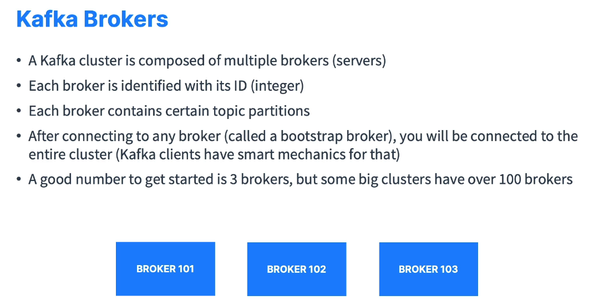
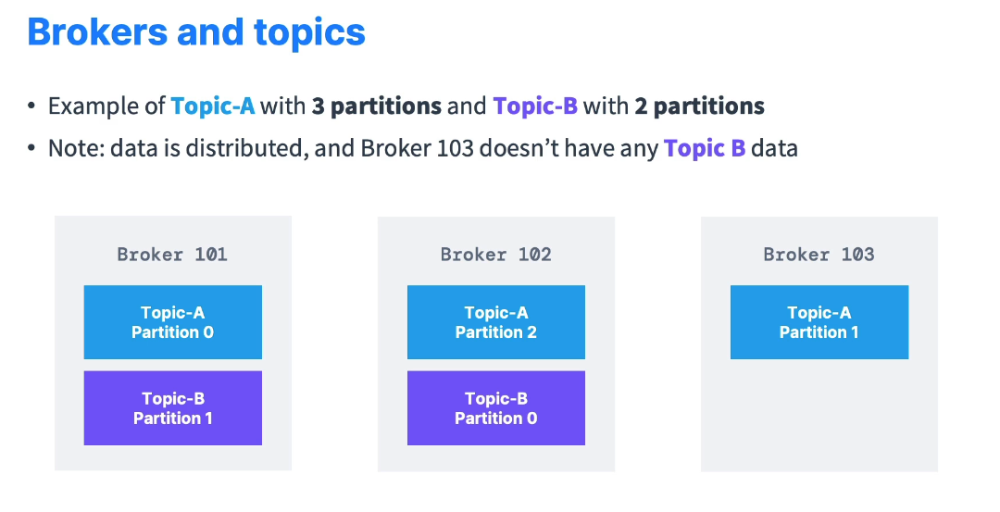
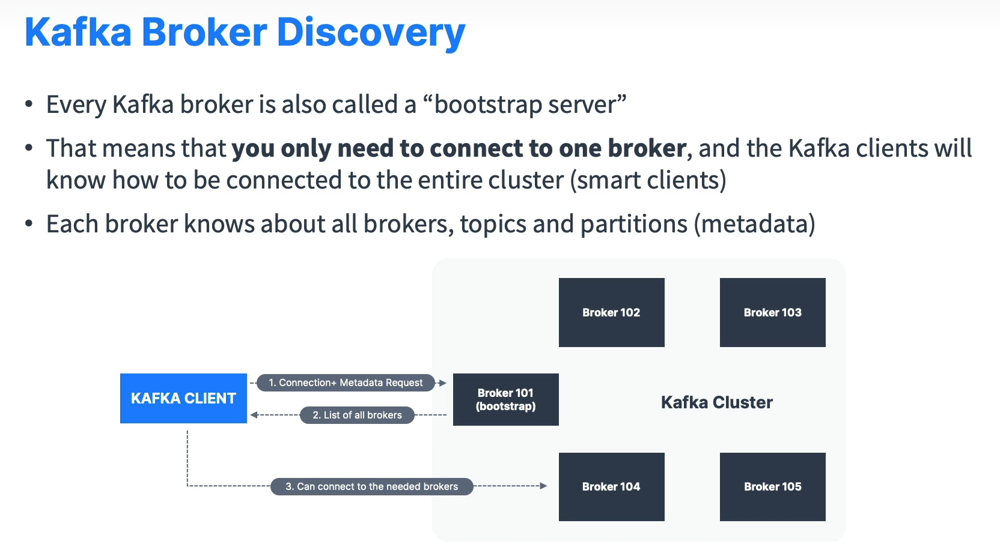

# Kafka Brokers

This document provides an overview of **Kafka Brokers**—the servers that form a **Kafka cluster** and handle the storage of data across **topic partitions**.

---

## Table of Contents

- [Kafka Brokers](#kafka-brokers)
  - [Table of Contents](#table-of-contents)
  - [What is a Kafka Broker?](#what-is-a-kafka-broker)
  - [Broker IDs](#broker-ids)
  - [Distribution of Topic Partitions](#distribution-of-topic-partitions)
  - [Broker Discovery Mechanism (Bootstrap Servers)](#broker-discovery-mechanism-bootstrap-servers)
  - [Scalability and Cluster Size](#scalability-and-cluster-size)
  - [Conclusion](#conclusion)

---

## What is a Kafka Broker?

- A **Kafka Broker** is essentially a **server** that receives and sends data.
- The **Kafka cluster** is composed of **multiple** brokers.
- Each broker holds **only certain partitions** of each topic; the data is **distributed** across the cluster.

---

## Broker IDs

- Each broker is **identified** by an **integer ID** (e.g., `101`, `102`, `103`).
- Clients (producers/consumers) use these IDs **internally** for **metadata** and **connection** information.

---

## Distribution of Topic Partitions

- **Topic partitions** are spread across all brokers.
- Example:
  - **Topic A** has 3 partitions:
    - `Partition 0` → Broker `101`
    - `Partition 1` → Broker `103`
    - `Partition 2` → Broker `102`
  - **Topic B** has 2 partitions:
    - `Partition 0` → Broker `102`
    - `Partition 1` → Broker `101`
  - Notice **Broker `103`** does not hold **Topic B** data. This is **normal**.
- This **horizontal distribution** of partitions across brokers helps **scale** Kafka.
- **Brokers** only store the **partitions** they are responsible for.
- When the more partitions and more brokers we add more the data will be spread out.

---

## Broker Discovery Mechanism (Bootstrap Servers)

- Every **broker** in a Kafka cluster is called a **bootstrap server**.
- When a **client** (producer or consumer) first connects, it only needs to connect to **one** broker:
  1. The client sends a **metadata request** to the chosen broker (e.g., Broker `101`).
  2. That broker returns **cluster metadata** including:
     - The **list of all brokers** in the cluster
     - The **list of topics** and **partitions**
  3. The client then knows **which** broker hosts the **partitions** it needs to read from or write to.
- This means you do **not** need to list **all** brokers to your client—**one** broker is enough to discover the entire cluster.

---

## Scalability and Cluster Size

- A typical **minimum production** setup might have **3 brokers**.
- Some large deployments run with **100+** brokers for high throughput and storage capacity.
- Adding more brokers helps **distribute** partitions further, **increasing** the system’s overall **scalability**.

---

## Conclusion

Kafka Brokers are the backbone of a **Kafka cluster**:

- They store **topic partitions** and handle **client requests**.
- By **distributing** data across multiple brokers, Kafka can **scale horizontally**.
- Each broker **knows** the metadata of the entire cluster, enabling clients to **bootstrap** from any single broker.
