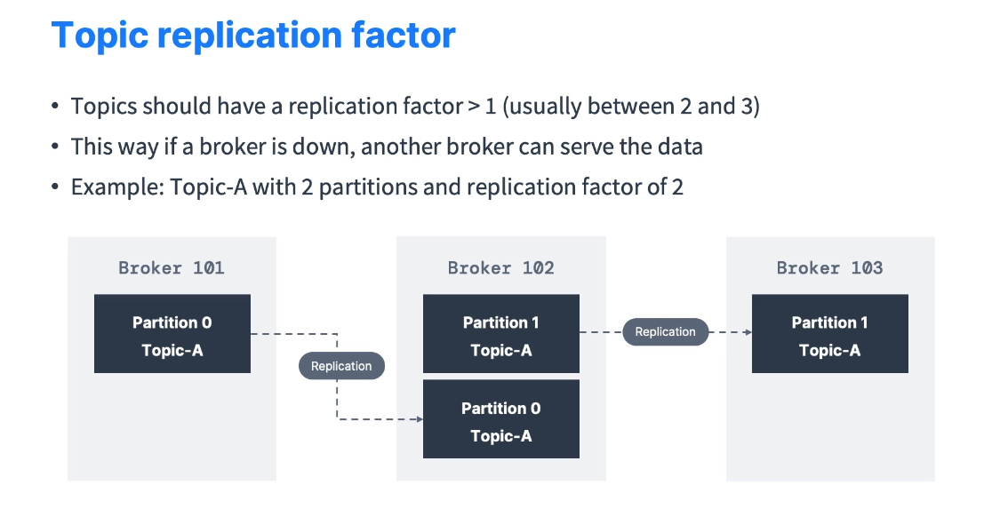

# Kafka Topic Replication Factor

This document provides an overview of **Kafka topic replication** and how it affects both **producers** and **consumers**. It covers the concept of **leaders**, **replicas**, **in-sync replicas (ISR)**, and introduces **replica fetching** by consumers in newer Kafka versions.

---

## Table of Contents

- [Kafka Topic Replication Factor](#kafka-topic-replication-factor)
  - [Table of Contents](#table-of-contents)
  - [Introduction](#introduction)
  - [Replication Factor Explained](#replication-factor-explained)
  - [Leaders and Replicas](#leaders-and-replicas)
    - [Diagram Example](#diagram-example)
  - [Producers and Consumers with Leaders](#producers-and-consumers-with-leaders)
  - [Consumer Replica Fetching](#consumer-replica-fetching)
  - [Conclusion](#conclusion)

---

## Introduction

- A **Kafka cluster** typically consists of **multiple brokers**.
- Each **topic** has a **replication factor** indicating how many brokers hold a **copy** of each partition.
- Replication is key for **fault tolerance**: if one broker goes down, another can serve as a **leader**.

---

## Replication Factor Explained

- **Replication Factor = N** means each **partition** is duplicated **N times** across different brokers.
- Common values in **production**: **2** or **3** (most often **3**).
- Example: **Topic-A** with **2 partitions** and a replication factor of **2** (RF=2):
  - Partition 0 stored on **Broker 101** (primary) and **Broker 102** (replica)
  - Partition 1 stored on **Broker 102** (primary) and **Broker 103** (replica)
- If **Broker 102** fails, **Broker 101** and **Broker 103** can still serve the data.

---

## Leaders and Replicas

- Each partition has **one broker** acting as the **leader** and **other brokers** as **replicas**.
- **Producers** and **consumers** communicate with the **leader** broker by default.
- If a broker fails, a **replica** can become the **new leader**.
- **In-Sync Replica (ISR)**: A replica that is **fully up-to-date** with the leader.

### Diagram Example

- **Partition 0** Leader → Broker 101
  - Replica → Broker 102
- **Partition 1** Leader → Broker 102
  - Replica → Broker 103

---

## Producers and Consumers with Leaders

- **Producer** writes only to the **leader** of the partition.
- **Consumer** (by default) reads only from the **leader** of the partition.
- Replicas continuously **replicate** the data from the leader but do **not** serve read or write requests unless configured otherwise or if they become the new leader.

---

## Consumer Replica Fetching

- **Introduced in Kafka 2.4**, consumers can **optionally** fetch data from the **closest replica** (not just the leader).
- Benefits:
  - **Reduced latency**: A consumer can read from the physically (or network-wise) closest broker.
  - **Decreased network cost**: Particularly useful in **cloud** or **multi-datacenter** environments.
- This feature is **optional** and depends on **consumer configuration**. It may not be enabled in older clusters or older client libraries.

---

## Conclusion

Replication ensures **fault tolerance** and **high availability** in a Kafka cluster. By:

- Storing **copies** of partitions on multiple brokers.
- Having a **leader** and **replicas** for each partition.
- Allowing **automatic failover** if a broker goes down.

Newer Kafka versions also support **consumer replica fetching**, further enhancing **read** flexibility. Understanding these concepts is fundamental to designing **resilient** and **scalable** Kafka architectures.
