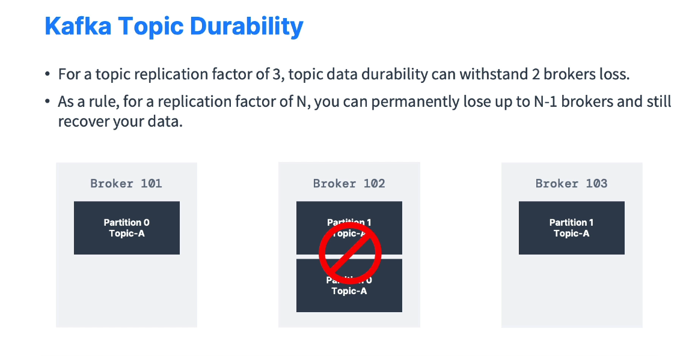

# Producer Acknowledgements and Topic Durability

This document provides a brief overview of **producer acknowledgements** and how they relate to **data durability** in Kafka. Understanding these concepts helps ensure that your data is written reliably and can withstand broker failures.

---

## Table of Contents

- [Producer Acknowledgements and Topic Durability](#producer-acknowledgements-and-topic-durability)
  - [Table of Contents](#table-of-contents)
  - [Producer Acknowledgements](#producer-acknowledgements)
    - [Acks = 0](#acks--0)
    - [Acks = 1](#acks--1)
    - [Acks = all](#acks--all)
  - [Kafka Topic Durability](#kafka-topic-durability)
    - [Example Scenario](#example-scenario)
  - [Conclusion](#conclusion)

---

## Producer Acknowledgements

When a **producer** sends data to a **Kafka broker**, it can **request** a level of **acknowledgment** (confirmation) indicating how **safely** the data is written.

### Acks = 0

- **No acknowledgment** from the broker.
- The producer does **not** wait to confirm if the broker **successfully** stored the message.
- **High risk** of **data loss** if the broker fails after receiving the message (the producer has no confirmation).

### Acks = 1

- The producer waits for **acknowledgment** from the **leader** of the partition.
- Provides **limited data loss** protection:
  - If the leader acknowledges the write but **fails** before the data is fully replicated, the newly written data might be lost.

### Acks = all

- The producer waits for **acknowledgment** from the **leader** **and** all **in-sync replicas (ISR)**.
- Offers **stronger guarantees** of **no data loss** under normal operation:
  - The data is considered **fully committed** once **all** in-sync replicas confirm the write.

---

## Kafka Topic Durability

- **Replication Factor (RF)** determines how many copies of each partition exist.
- If RF = **N**, the topic can tolerate losing up to **N-1** brokers without permanently losing data.
- Example:
  - With RF = 2, losing **one** broker still leaves another broker holding a **replica** of the data.
  - With RF = 3, losing up to **two** brokers can still preserve data availability.

### Example Scenario

- **Topic** with **RF = 2** running on **3 brokers** (`broker101`, `broker102`, `broker103`).
- **Partition 0** stored on `broker101` (leader) and replicated on `broker102`.
- If `broker102` fails, the copy on `broker103` or `broker101` (depending on configuration) still serves the data.

---

## Conclusion

- **Producer acknowledgment settings** (`acks=0`, `acks=1`, `acks=all`) influence **data reliability** and **performance**.
- **Replication factor** and **in-sync replicas** (ISR) further ensure that **data can survive broker failures**.
- Choosing the **right acknowledgment** setting and **replication factor** is critical for **balancing** performance, latency, and **fault tolerance** in your Kafka deployment.
