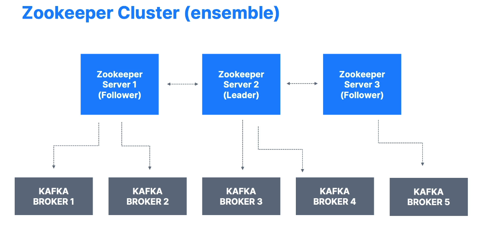

# Zookeeper and Kafka

This document provides an overview of **Zookeeper** as it relates to Apache Kafka, its current role, and how it is transitioning out of future Kafka releases.

---

## Table of Contents

- [Zookeeper and Kafka](#zookeeper-and-kafka)
  - [Table of Contents](#table-of-contents)
  - [What is Zookeeper?](#what-is-zookeeper)
  - [Kafka with Zookeeper](#kafka-with-zookeeper)
  - [The Transition to Kraft (Kafka Raft)](#the-transition-to-kraft-kafka-raft)
  - [Zookeeper Architecture](#zookeeper-architecture)
  - [Zookeeper and Kafka Clients](#zookeeper-and-kafka-clients)
  - [Should You Use Zookeeper?](#should-you-use-zookeeper)
  - [Summary](#summary)

---

## What is Zookeeper?

- **Zookeeper** is a **coordination service** used originally by Kafka to:
  - Keep track of **broker metadata** (which brokers are up, down, etc.).
  - **Elect leaders** for partitions whenever a broker goes down or comes up.
  - **Notify** Kafka brokers about changes (topics created, topics deleted, etc.).
- Historically, **Kafka** relied on Zookeeper to function, which means **Kafka couldn’t start** without Zookeeper.

---

## Kafka with Zookeeper

- In **older Kafka versions** (up to the 2.x line), **Zookeeper** is essential:
  - **Brokers** connect to Zookeeper for **cluster membership** and **metadata**.
  - **Leader elections** for partitions happen through Zookeeper.
- **Consumers** initially stored offsets in Zookeeper (long ago), but since **Kafka 0.10**, offsets have been stored in the **`__consumer_offsets`** internal Kafka topic.

---

## The Transition to Kraft (Kafka Raft)

- **Kraft (Kafka Raft)** is an upcoming replacement for Zookeeper in Kafka.
- **KIP-500** outlines this initiative, aiming to remove the **Zookeeper dependency**:
  - **Kafka 3.x** can work **without** Zookeeper in certain **preview/early** modes.
  - A **future major version** (Kafka 4.x) plans to **fully remove** Zookeeper.
- Despite this, **most production environments** today still rely on **Zookeeper**.

---

## Zookeeper Architecture

- Zookeeper clusters typically have an **odd number of servers**: 1, 3, 5, or 7.
- **One server** is the **leader**, the others are **followers**.
- Writes go through the **leader**, reads can be served by **any** node.
- **Security**: Zookeeper is generally **less secure** than Kafka, so you should **restrict Zookeeper access** to brokers only, not to external clients.

---

## Zookeeper and Kafka Clients

- **Modern Kafka clients** (producers, consumers, admin clients) **do not** connect directly to Zookeeper.
- All **communication** for reading/writing data or managing topics now happens through **Kafka brokers**.
- Older documentation or examples may show clients connecting to Zookeeper, but **this practice is outdated** and **should be avoided**.

---

## Should You Use Zookeeper?

- If you’re running **current** or **older** Kafka releases in **production**, you still **need Zookeeper**.
- **However**, client-side code (producers, consumers, admin tools) should **only** talk to **Kafka brokers**, **never** directly to Zookeeper.
- **Future** Kafka releases (4.x and beyond) aim to **remove** Zookeeper entirely, using **Kraft** for cluster coordination.

---

## Summary

- **Zookeeper** has been integral to Kafka’s internal coordination since its inception.
- Kafka is **transitioning** to a **Zookeeper-less** architecture using **Kraft**.
- **Today**:
  - **Brokers** connect to Zookeeper in most production deployments.
  - **Clients** (producers/consumers) should **only** connect to **Kafka brokers**.
- **Tomorrow**:
  - Kafka 4.x or higher will **eliminate** Zookeeper, making this dependency **obsolete**.
