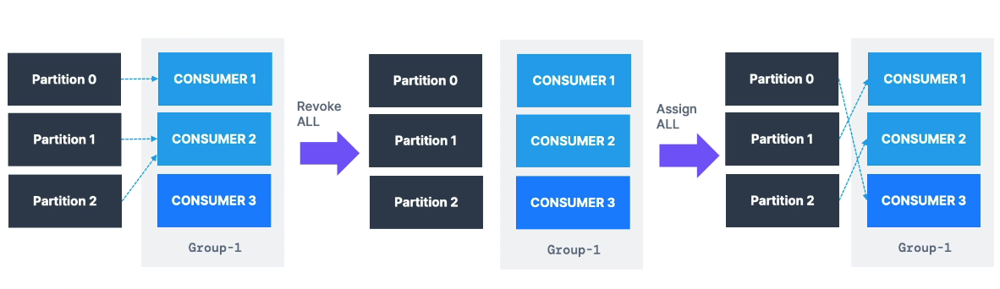
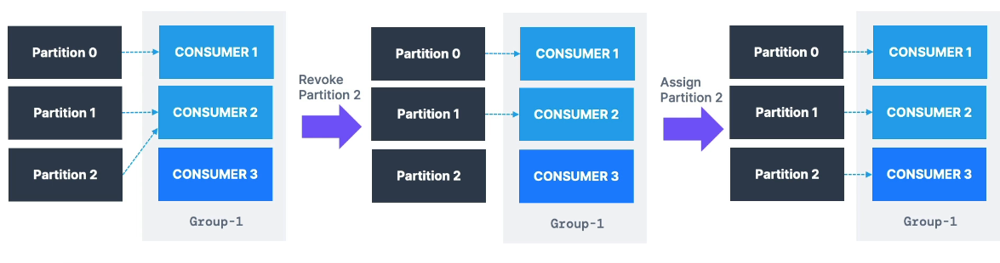

# Kafka Consumer Rebalance Strategies and Protocols

This document explains how Kafka handles **consumer rebalancing**, describes different **partition assignment strategies**, and introduces **cooperative rebalancing** and **static group membership**.

---

## 🎯 Objective

- Understand how rebalancing works in consumer groups
- Learn the difference between **eager** and **cooperative** rebalancing
- Discover how to optimize consumer group stability using **static membership**

---

## 🔁 What Triggers a Rebalance?

- A **consumer joins** or **leaves** a group
- **New partitions** are added to a topic

When this happens, Kafka **reassigns partitions** to consumers. This process is called **rebalance**.

---

## 📌 Eager Rebalance (Default Strategy Before Kafka 3.0)



### How It Works:

1. A new consumer joins the group
2. **All consumers stop** reading (stop-the-world event)
3. All partition assignments are **revoked**
4. Consumers rejoin and **receive new assignments**

### 🔻 Drawbacks:

- No guarantees that consumers retain the same partitions
- All processing temporarily halts
- Can be **disruptive** for large consumer groups

---

## ✅ Cooperative Rebalance (Incremental Rebalance)

Introduced to **minimize disruption** during rebalances.



### How It Works:

1. Only a **subset of partitions** are reassigned
2. Consumers not affected by partition movement continue processing
3. Rebalancing proceeds in **multiple incremental steps** until assignment is stable

### Example:

- Topic: 3 partitions
- Initial: 2 consumers
- When a 3rd consumer joins:
  - Only partition 2 is revoked from one consumer and assigned to the new one
  - Partition 0 and 1 continue to be processed

✅ This ensures continuous data consumption with minimal disruption.

---

# More on this..

# Partition Assignors in Apache Kafka

This markdown file provides a detailed explanation of several partition assignment strategies in Apache Kafka. When multiple consumers are part of the same consumer group, Kafka must decide how to distribute (or “assign”) topic partitions across these consumers. Each consumer in the group is configured with an assignment strategy, also known as an “assignor.” Below are four key assignors, complete with examples illustrating how they handle initial partition assignment and what happens during a rebalance when a new consumer joins.

---

## 1. RangeAssignor

### Key Idea

- **Partitions** are assigned to each consumer in **contiguous ranges** on a **per-topic** basis.

### How It Works

1. Kafka **sorts** the partitions of each topic.
2. It divides them among consumers **as evenly as possible**, but in one **contiguous block** per consumer.
3. This is done **per topic**, so the final distribution may be uneven if multiple topics are subscribed.

### Simple Example (Initial Assignment)

- **Topic**: `myTopic` with 4 partitions → `myTopic-0, myTopic-1, myTopic-2, myTopic-3`
- **Consumers**: C1, C2
- **RangeAssignor**:
  - Sort partitions: `[0, 1, 2, 3]`
  - Divide them in contiguous chunks across consumers:
    - C1 → `[0, 1]`
    - C2 → `[2, 3]`

### Rebalance Example (New Consumer Joins)

- **Original**:
  - C1 → `[0, 1]`
  - C2 → `[2, 3]`
- **New consumer**: C3
- RangeAssignor (in the traditional “full rebalance” mode) likely revokes all current assignments and then reassigns:
  - C1 → `[0]`
  - C2 → `[1]`
  - C3 → `[2, 3]`
- This can cause more disruption because the existing consumers lose all partitions before re-claiming them.

### Best and Worst Cases

- **Best Case**: If the number of partitions is evenly divisible by the number of consumers (e.g., 4 partitions, 2 consumers), each consumer gets an equal share.
- **Worst Case**: If there’s a mismatch (e.g., 4 partitions, 3 consumers), one consumer might end up with 2 partitions while others have 1 each, leading to less balance. Also, each rebalance can revoke all assignments at once.

---

## 2. RoundRobinAssignor

### Key Idea

- Partitions from **all subscribed topics** are combined in a **single sorted list**, then assigned **one-by-one in a circular manner** to each consumer.

### How It Works

1. Collect all partitions across all topics into one list and sort them.
2. Assign the partitions in a round-robin fashion to consumers.
3. This typically results in a **more even** distribution of total partitions if multiple topics are involved.

### Simple Example (Initial Assignment)

- **Topic**: `myTopic` with 4 partitions → `[0, 1, 2, 3]`
- **Consumers**: C1, C2
- **Process**:
  1. C1 → partition `0`
  2. C2 → partition `1`
  3. C1 → partition `2`
  4. C2 → partition `3`
- **Result**:
  - C1 → `[0, 2]`
  - C2 → `[1, 3]`

### Rebalance Example (New Consumer Joins)

- **Original**:
  - C1 → `[0, 2]`
  - C2 → `[1, 3]`
- **New consumer**: C3
- Often does a full revoke and then reassigns in round-robin:
  1. C1 → `0`
  2. C2 → `1`
  3. C3 → `2`
  4. C1 → `3`
- **Result**:
  - C1 → `[0, 3]`
  - C2 → `[1]`
  - C3 → `[2]`
- This can cause considerable partition movement if membership changes frequently.

### Best and Worst Cases

- **Best Case**: Ensures an even **count** of partitions per consumer, particularly if the total number of partitions aligns well with the consumer count.
- **Worst Case**: Can be quite disruptive on rebalances because it typically reshuffles everything, even if only one consumer joined or left.

---

## 3. StickyAssignor

### Key Idea

- **Minimize partition movement** (“stickiness”) across rebalances while maintaining a **reasonably balanced** load.

### How It Works

1. The assignor starts by trying to balance partitions among consumers.
2. On a rebalance, **it tries to keep as many partitions on their current owners** as possible.
3. Only **moves** partitions if it must, in order to keep the load balanced across the group.

### Simple Example (Initial Assignment)

- **Topic**: `myTopic` with 4 partitions → `[0, 1, 2, 3]`
- **Consumers**: C1, C2
- Might assign something like:
  - C1 → `[0, 1]`
  - C2 → `[2, 3]`
- This is fairly balanced from the start.

### Rebalance Example (New Consumer Joins)

- **Original**:
  - C1 → `[0, 1]`
  - C2 → `[2, 3]`
- **New consumer**: C3
- StickyAssignor tries to minimize movement. For instance, it could end with:
  - C1 → `[0]`
  - C2 → `[2]`
  - C3 → `[1, 3]`
- Here, only partitions `[1]` and `[3]` moved from their original owners. This is less disruptive than reassigning everything.

### Best and Worst Cases

- **Best Case**: If you have frequent membership changes, StickyAssignor reduces overhead by moving only what’s necessary to remain balanced.
- **Worst Case**: Strictly perfect distribution might be slightly compromised if preserving existing assignments takes priority, but generally it still aims for balance.

---

## 4. CooperativeStickyAssignor (Cooperative Sticky)

### Key Idea

- Extends the sticky approach with **incremental cooperative rebalancing**, where **only the needed partitions** are revoked during a rebalance rather than revoking everything.

### How It Works

1. Similar to StickyAssignor in that it tries to maintain **existing assignments**.
2. **Cooperative** means it may revoke only a subset of partitions to new consumers, leaving the rest untouched.
3. Avoids the “all consumers revoke all partitions” approach of non-cooperative strategies.

### Simple Example (Initial Assignment)

- **Topic**: `myTopic` with 4 partitions → `[0, 1, 2, 3]`
- **Consumers**: C1, C2
- Could begin with:
  - C1 → `[0, 1]`
  - C2 → `[2, 3]`

### Rebalance Example (New Consumer Joins)

- **Original**:
  - C1 → `[0, 1]`
  - C2 → `[2, 3]`
- **New consumer**: C3
- With **cooperative** rebalancing, we might end up with:
  - C1 keeps `[0]`
  - C2 keeps `[2]`
  - C3 gets `[1, 3]`
- The difference from older strategies is that **consumption of `[0]` and `[2]` never has to pause** on C1 and C2 because only `[1]` and `[3]` are actually revoked and moved to C3.

### Best and Worst Cases

- **Best Case**: Minimal disruption on membership changes, especially helpful for **stateful processing** (e.g., Kafka Streams) since not all partitions are revoked at once.
- **Worst Case**: Requires **all** consumers in the group to use a cooperative strategy; mixing with older strategies can force a full rebalance.

---

## Example Comparison Table

Below is a quick reference comparing the initial assignments for 2 consumers and the outcome when a 3rd joins (assuming a single topic, 4 partitions):

| Assignor                      | Initial (2 consumers)    | After Adding 3rd Consumer                                  |
| ----------------------------- | ------------------------ | ---------------------------------------------------------- |
| **RangeAssignor**             | C1 → [0, 1], C2 → [2, 3] | C1 → [0], C2 → [1], C3 → [2, 3]                            |
| **RoundRobinAssignor**        | C1 → [0, 2], C2 → [1, 3] | C1 → [0, 3], C2 → [1], C3 → [2]                            |
| **StickyAssignor**            | C1 → [0, 1], C2 → [2, 3] | C1 → [0], C2 → [2], C3 → [1, 3]                            |
| **CooperativeStickyAssignor** | C1 → [0, 1], C2 → [2, 3] | C1 → [0], C2 → [2], C3 → [1, 3] (with an incremental move) |

---

## Which Assignor to Choose?

- **RangeAssignor**:

  - Default in many Kafka versions, simpler logic.
  - Can lead to imbalance if partitions ≠ consumers \* n, and triggers a full rebalance.

- **RoundRobinAssignor**:

  - Distributes partitions more evenly across consumers.
  - Also triggers a full rebalance, potentially moving many partitions unnecessarily.

- **StickyAssignor**:

  - Balances while prioritizing **minimizing partition movement**.
  - Good if consumers join/leave often and you want to avoid re-processing or heavy overhead.

- **CooperativeStickyAssignor**:
  - Similar to Sticky but supports **incremental** partition revocation.
  - Great for Kafka Streams or other stateful apps, significantly reducing “stop the world” rebalances.

---

## Final Thoughts and Tips

1. **Consumer Group Membership**: Each consumer’s join/leave triggers a rebalance. Minimizing these events (or choosing an assignor that handles them gracefully) can improve stability.
2. **Number of Partitions vs. Consumers**: Ideally, total partitions ≥ total consumers so each consumer gets at least one partition.
3. **Choose a Strategy**:
   - If you value simplicity and your group is quite stable, RangeAssignor or RoundRobin might suffice.
   - If you deal with frequent membership changes or rely on stateful tasks, Sticky or CooperativeSticky is often preferred.
4. **Kafka Version**: CooperativeStickyAssignor is available in Kafka 2.4+ (with improvements in later versions). Ensure all consumers support it before switching.

## ⚙️ Partition Assignment Strategies

| Strategy                    | Type        | Description                                                      |
| --------------------------- | ----------- | ---------------------------------------------------------------- |
| `RangeAssignor`             | Eager       | Assigns partitions per topic; can cause imbalance                |
| `RoundRobinAssignor`        | Eager       | Distributes all partitions evenly in round-robin fashion         |
| `StickyAssignor`            | Eager       | Minimizes partition movement but is still eager (stop-the-world) |
| `CooperativeStickyAssignor` | Cooperative | Like Sticky but supports incremental rebalancing                 |

### 🔄 Kafka 3.0 Default:

```java
RangeAssignor, CooperativeStickyAssignor
```

- If only `RangeAssignor` is present, Kafka performs **eager** rebalance.
- To enable **cooperative rebalance**, remove `RangeAssignor` from the list.

---

## 🛠 Enabling Cooperative Rebalance

**Set the following in consumer configuration:**

```java
properties.setProperty("partition.assignment.strategy", "org.apache.kafka.clients.consumer.CooperativeStickyAssignor");
```

✅ Used by default in:

- **Kafka Connect**
- **Kafka Streams** (via `StreamsPartitionAssignor`)

---

## 🧷 Static Group Membership

### Why?

Avoid unnecessary rebalances when a consumer **temporarily disconnects**.

### How?

Assign a **group instance ID** per consumer:

```java
properties.setProperty("group.instance.id", "consumer-1");
```

### Benefits:

- If a consumer restarts within the session timeout, Kafka **preserves partition assignments**
- **No rebalance is triggered**

✅ Ideal for:

- Consumers with **local caches** or **stateful processing**
- Kubernetes environments where restarts are frequent

---

## 🧠 Summary

| Strategy                  | Rebalance Type | Minimizes Partition Movement | Processing Continues |
| ------------------------- | -------------- | ---------------------------- | -------------------- |
| RangeAssignor             | Eager          | ❌                           | ❌                   |
| RoundRobinAssignor        | Eager          | ❌                           | ❌                   |
| StickyAssignor            | Eager          | ✅                           | ❌                   |
| CooperativeStickyAssignor | Cooperative    | ✅                           | ✅                   |

---

Using the **CooperativeStickyAssignor** and **static membership** leads to more stable, efficient, and production-friendly Kafka consumers.

Stay tuned for the next lesson on implementing these strategies in your Kafka applications. 🚀
