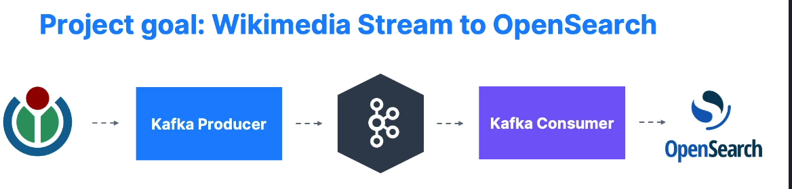

# Real-World Kafka Implementation Project

## Introduction

In this section, we will leverage our Kafka skills to implement a real-world project. This involves programming, but there will also be a lot of emphasis on Kafka-specific concepts.

## Project Overview

We get data from widkimedia through kafka producer into kafka topics. The consumer takes these data and sends this data to OpenSearch.

Kafka Project

- [Recent Changes](https://stream.wikimedia.org/v2/stream/recentchange)
- [Code Pen](https://codepen.io/Krinkle/pen/BwEKgW?editors=1010)
- [Demo](https://esjewett.github.io/wm-eventsource-demo/)
- [Source Code](https://stream.wikimedia.org/v2/stream/recentchange)
